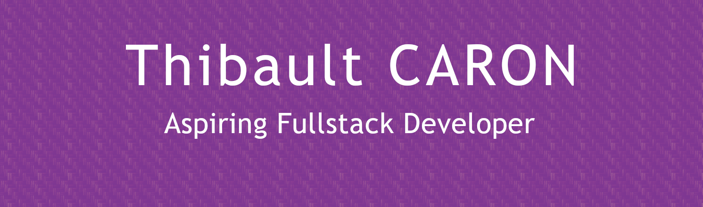

# Welcome 👋
<!--
**thibault-caron/thibault-caron** is a ✨ _special_ ✨ repository because its `README.md` (this file) appears on your GitHub profile.
-->

My name is `Thibault Caron`, I'm a full-stack software developer from France, and this is the Github account for my work at the IT school [La Plateforme](https://laplateforme.io/). 
You can find me on [LinkedIn](https://www.linkedin.com/in/thibault-caron-b848b668/) and on my [original GitHub account](https://github.com/abadyr).

I'm currently looking for a work-study placement in software development.

## 🛠 Technologies & Tools

<!--

-->
## &#x1f4c8; GitHub Stats

---

## 🏆 GitHub Profile Trophy

<!-- Resources -->
<!-- Icons: https://simpleicons.org/ -->
<!-- GitHub Stats: https://github.com/anuraghazra/github-readme-stats -->
<!-- Emojis: https://emojipedia.org/emoji/ -->
<!-- HTML Emojis: https://www.fileformat.info/index.htm -->
<!-- Shields: https://shields.io/ -->
<!-- Awesome GitHub Profile README: https://github.com/abhisheknaiidu/awesome-github-profile-readme -->